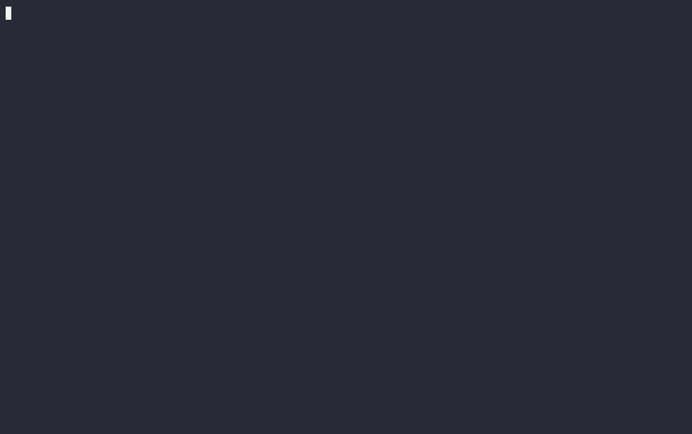

# cw-otel-cli (`cwpromql`)

Query **CloudWatch OTLP metrics with PromQL — from your terminal.**

[](https://github.com/lewinkedrs/cw-otel-cli/actions/workflows/ci.yml)
[](./LICENSE)

CloudWatch exposes a Prometheus-compatible HTTP API for metrics ingested via
OpenTelemetry (OTLP), but there is **no `aws` CLI command for it**. To use it you
have to hand-sign an HTTP request with AWS SigV4 (service `monitoring`) against
`https://monitoring.<region>.amazonaws.com/api/v1/...`. That's fine for a one-off
`curl`, but painful for day-to-day exploration.

`cwpromql` fills that gap. It owns the signing, discovery, and rendering so you
can list metrics, run PromQL, and view **charts and tables right in the terminal**
— or emit JSON/CSV to pipe into `jq` and friends.



---

## Contents

- [How it works](#how-it-works)
- [Install](#install)
- [Authentication & IAM](#authentication--iam)
- [Quick start](#quick-start)
- [Command reference](#command-reference)
- [Output formats](#output-formats)
- [Watch mode](#watch-mode)
- [Use with AI agents (SKILL.md)](#use-with-ai-agents-skillmd)
- [PromQL syntax notes](#promql-syntax-notes)
- [Troubleshooting](#troubleshooting)
- [Project layout](#project-layout)
- [Development](#development)
- [Roadmap](#roadmap)

---

## How it works

CloudWatch's PromQL API is Prometheus-compatible but authenticated with **AWS
SigV4** (service name `monitoring`). `cwpromql`:

1. Loads credentials via the standard AWS SDK for Go v2 chain (env vars, shared
   config, SSO, `credential_process`, `--profile`).
2. Signs each request with SigV4.
3. Calls the Prometheus endpoints and renders the standard JSON envelope as a
   table, chart, or raw JSON/CSV.

| Endpoint | Used by | Purpose |
|---|---|---|
| `/api/v1/query` | `query` | instant query (one value per series) |
| `/api/v1/query_range` | `range` | time series over a window |
| `/api/v1/series` | `series` | series matching a selector |
| `/api/v1/labels` | `labels` | all label names |
| `/api/v1/label/<name>/values` | `label-values`, `metrics` | values for a label |

---

## Install

Requires **Go 1.24+**.

```bash
git clone https://github.com/lewinkedrs/cw-otel-cli.git
cd cw-otel-cli

# Many corporate networks block the default Go module proxy (proxy.golang.org).
# If `go build` hangs on "dial tcp ... proxy.golang.org", fetch modules directly:
go env -w GOPROXY=direct GOSUMDB=off

# Build a local binary:
go build -o bin/cwpromql .

# …or install onto your PATH:
go install .        # -> $(go env GOPATH)/bin/cwpromql
```

If `$(go env GOPATH)/bin` isn't on your `PATH`, symlink the binary into a dir
that is (e.g. `~/.local/bin`):

```bash
ln -sf "$(go env GOPATH)/bin/cwpromql" ~/.local/bin/cwpromql
```

> After re-installing, if your shell still says "command not found", run
> `hash -r` (bash) / `rehash` (zsh) or open a new terminal.

---

## Authentication & IAM

`cwpromql` uses your ambient AWS credentials — nothing to configure if the AWS
CLI already works. The region is resolved from your environment/profile
(`AWS_REGION`, `AWS_DEFAULT_REGION`, or the profile's configured region); use
the global flags to override the profile or region:

```bash
cwpromql --region us-west-2 --profile my-profile metrics
```

The calling identity needs these IAM actions (the ones behind the PromQL API):

- `cloudwatch:GetMetricData` — instant and range queries
- `cloudwatch:ListMetrics` — series and label/metric discovery

Credentials are short-lived in many setups; if a call fails with a credentials
error, refresh them (e.g. `ada credentials update …`, `aws sso login`, etc.) and
retry.

---

## Quick start

```bash
# What metrics exist?
cwpromql metrics --filter http.server

# What values does a label take?
cwpromql label-values @resource.k8s.namespace.name

# Instant snapshot as a table
cwpromql query 'sum by ("@resource.k8s.namespace.name")({"up"})'

# Trend over the last hour as a chart
cwpromql range 'sum({"up"})' --since 1h

# Live, top-style refresh
cwpromql range 'sum({"up"})' --since 30m --watch 10s
```

---

## Command reference

Global flags (apply to every command):

| Flag | Default | Meaning |
|---|---|---|
| `--region` | (from AWS env/profile) | AWS region; overrides `AWS_REGION` / profile |
| `--profile` | (chain) | AWS shared-config profile |
| `-o, --output` | per-command | `table` \| `chart` \| `json` \| `csv` |
| `--limit` | `0` (API max) | max series to return |
| `--no-color` | `false` | disable colored charts |

### `metrics` — list metric names

```bash
cwpromql metrics                      # all metric names
cwpromql metrics --filter http        # case-insensitive substring filter
cwpromql metrics -o json | jq length  # count
```
```
http.server.active_requests
http.server.duration
http.server.request.body.size
http.server.request.duration
```

### `labels` — list label names

```bash
cwpromql labels
cwpromql labels --filter resource.k8s
```
```
@resource.k8s.cluster.name
@resource.k8s.container.name
@resource.k8s.namespace.name
@resource.k8s.node.name
```

### `label-values <label>` — values of one label

```bash
cwpromql label-values @resource.k8s.namespace.name
```
```
agent-observability  amazon-cloudwatch  claude-code
kube-system          otel-demo          prom-app-demo
```

### `query <promql>` — instant query

Renders one row per series (default `table`).

```bash
cwpromql query '{"up"}'
cwpromql query 'sum by ("@resource.k8s.namespace.name")({"up"})'
cwpromql query '{"up"}' -o json | jq .
```
```
SERIES                                  VALUE
k8s.namespace.name=kube-system          6
k8s.namespace.name=otel-demo            2
k8s.namespace.name=prom-app-demo        2

6 series
```

### `range <promql>` — range query (chart)

Renders a colored multi-series ASCII chart (default `chart`).

| Flag | Default | Meaning |
|---|---|---|
| `--since` | `1h` | look-back window (`30m`, `1h`, `24h`) |
| `--step` | auto | resolution step (`60s`); auto ≈ 240 points, 15s floor |
| `--watch` | off | re-render on an interval (`10s`); Ctrl+C to stop |
| `--height` | `12` | chart rows |
| `--width` | terminal | chart columns |

```bash
cwpromql range 'sum({"up"})' --since 1h
cwpromql range '{"up"}' --since 3h --step 60s
cwpromql range 'sum by ("@resource.k8s.namespace.name")({"up"})' --since 1h -o table
```

`-o table` on a range shows a downsampled sparkline plus min/max/last per series:

```
SERIES                                  TREND                MIN   MAX   LAST
k8s.namespace.name=kube-system          ▁▁▁▁▁▁▁▁▁▁▁▁▁▁▁▁▁▁▁▁  6.00  6.00  6.00
k8s.namespace.name=otel-demo            ▁▁▁▁▁▁▁▁▁▁▁▁▁▁▁▁▁▁▁▁  2.00  2.00  2.00
```

### `series <selector>` — matching series

Lists the series matching a selector over a time window.

```bash
cwpromql series '{"up"}' --since 1h
cwpromql series '{"claude_code.token.usage"}' --since 1h -o json | jq '.[0] | keys'
```

Use `-o json` to see the **full label set** of each series — the default view
shows a shortened name.

---

## Output formats

| `-o` | `query` (instant) | `range` |
| --- | --- | --- |
| *(unset)* | `table` | `chart` |
| `table` | series + value | sparkline + min/max/last |
| `chart` | — | colored ASCII line chart |
| `json` | Prometheus samples | Prometheus matrix |
| `csv` | series,value,timestamp | — |

Charts are colored by default; disable with `--no-color` (colors are ANSI escape
codes, so use `--no-color` when redirecting chart output to a file).

---

## Watch mode

`--watch <interval>` turns `range` into a live, `top`-style dashboard: it clears
the screen and re-renders on the interval until you press Ctrl+C.

```bash
cwpromql range 'sum({"up"})' --since 30m --watch 10s
```

---

## Use with AI agents (SKILL.md)

This repo ships a [`SKILL.md`](./SKILL.md) — a concise, agent-oriented guide that
teaches an AI coding assistant **when and how to use `cwpromql`**. It captures the
hard rules (OTLP metrics don't appear in `aws cloudwatch list-metrics`; never
hand-roll SigV4; every selector needs an exact metric-name matcher), the command
reference, the CloudWatch PromQL dialect (`@resource.` prefixes, delta counters),
worked examples, and common gotchas.

**Why:** without it, an agent asked to "check the GPU metrics" will often run
`aws cloudwatch get-metric-data`, find nothing, and wrongly conclude the metrics
are missing. `SKILL.md` redirects it to `cwpromql` and the right query syntax.

**How to use it in your agent of choice** — point the assistant at the file so it
loads as context/rules:

- **Kiro:** copy or symlink it into your steering dir, e.g.
  `cp SKILL.md ~/.kiro/steering/cwpromql.md`, or reference it from an existing
  steering file.
- **Claude Code:** append its contents to `CLAUDE.md` (or `@import` the file) in
  your project or `~/.claude/`.
- **Codex:** add it to your `AGENTS.md` (Codex auto-loads `AGENTS.md`), or paste
  the contents into the custom instructions.
- **Any other agent:** paste the contents into the system prompt / custom
  instructions, or just keep `SKILL.md` in the repo the agent has open — most
  file-aware agents will pick it up on their own.

The file is plain Markdown with no tool-specific syntax, so it drops into any of
these without changes. Keep it updated alongside the CLI as commands evolve.

---

## PromQL syntax notes

Metrics ingested via OTLP use **dotted names** and must be quoted inside braces:

```promql
{"http.server.duration_count"}
sum by ("@resource.service.name")({"http.server.duration_count"})
{"up","@resource.k8s.namespace.name"="otel-demo"}
```

**Every selector must include an exact metric-name matcher.** Regex-on-name
(`{__name__=~".+"}`) or label-only selectors are rejected by CloudWatch with
HTTP 400. `cwpromql` catches this client-side with a clear message before
sending the request.

OTLP attributes are addressed by scope prefix:

| Scope | Attribute prefix | Example |
|---|---|---|
| Resource | `@resource.` | `@resource.service.name="cart"` |
| Instrumentation | `@instrumentation.` | `@instrumentation.@name="cloudwatch.aws/ec2"` |
| Datapoint | `@datapoint.` or bare | `type="input"` |
| AWS-reserved | `@aws.` | `@aws.account="123456789012"` |

Vended AWS metrics (once OTel enrichment is enabled) keep their CloudWatch names
and dimensions, e.g. `{Invocations, FunctionName="my-api-handler"}`.

---

## Troubleshooting

**`dial tcp ... proxy.golang.org: i/o timeout` during build**
Your network blocks the Go module proxy. Run `go env -w GOPROXY=direct GOSUMDB=off`
and rebuild (fetches modules directly from GitHub).

**`command not found: cwpromql` after install**
`$(go env GOPATH)/bin` isn't on your PATH — symlink into `~/.local/bin` (see
[Install](#install)) — or your shell cached a miss: run `hash -r` / `rehash`.

**Credentials error / HTTP 403**
Refresh your AWS credentials and confirm the identity has `cloudwatch:GetMetricData`
and `cloudwatch:ListMetrics`. Check with `aws sts get-caller-identity`.

**`selector needs an exact metric name`**
Add a metric name to the selector, e.g. `{"up"}` or `{__name__="up"}`. See
[PromQL syntax notes](#promql-syntax-notes).

**Empty results**
The PromQL API only scans a 24-hour window; widen `--since` within that limit,
and confirm the metric exists with `cwpromql metrics --filter <name>`.

---

## Project layout

```
main.go                     entrypoint -> cli.Execute()
internal/awscfg/creds.go    AWS default credential chain
internal/promql/            SigV4 client, typed vector/matrix decoding,
                            metric-name guard, unit + live tests
internal/cli/               cobra commands + table/chart/json/csv/sparkline rendering
```

---

## Development

```bash
make all         # fmt-check + vet + test + build (see the Makefile for targets)
make build       # -> ./bin/cwpromql
make cover       # tests with a coverage summary
make live        # live smoke test (needs AWS creds)
```

Check the version of an installed binary:

```bash
cwpromql --version
```

Shell completions (bash/zsh/fish/powershell) are generated by cobra:

```bash
cwpromql completion zsh > "${fpath[1]}/_cwpromql"    # example for zsh
```

See [CONTRIBUTING.md](./CONTRIBUTING.md) for the full workflow.

---

## License

Released under the [MIT License](./LICENSE).

---

## Roadmap

- Query history file and saved queries.
- Label-value / metric-name autocomplete.
- `rate()`/derived helpers and richer chart legends.
- `series --by <label>` grouping and full-label default view.
